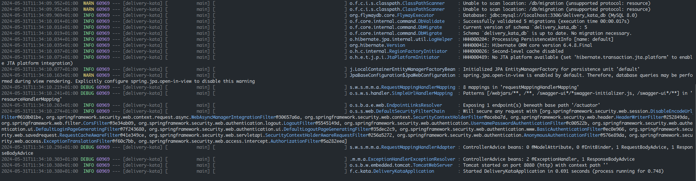

# 🚚 DriveAndDeliver - a Carrefour kata

> Here is a pretty free implementation exercise to be completed in a short period of time.\
> It aims to be a conversation starter during a future interview.\
> Since the goal is to discuss choices and good use of conceptes, we recommend that you spend no more than 2 hours on it, even if you haven't had the time to finish the mandatory User Stories. 

## Instructions
The exercise is made of a mandatory part, the [Minimum Valuable Product](#mvp), and [bonus features](#features-bonus) to make the most of your remaining time and stand out.\
The stories have no acceptance criteria, it's up to you to define them after your functional analysis of the story.

**If you are missing some information, make a choice and stick to it.**

### Constraints
- Spring-boot 3.x.x
- Java 21
- Git
- Enhance this `README.md` file -- _Explains the potential intricacies of your implementation and how to launch your project_.

### Delivery
The code should be available as a project in gitlab.

### Assessment
**There is no "right" way to do this exercise.**\
We are interested in your implementation choices, your technique, the code architecture and the compliance with the constraints.\
_Also pay attention to the size of your commits and their messages._

### Tips
To quickly create your project base, use [spring initializr](https://start.spring.io/)

## Exercise
### MVP
#### User Story
> As a customer, I can choose my delivery method.\
> The available delivery methods are: `DRIVE`, `DELIVERY`, `DELIVERY_TODAY`, `DELIVERY_ASAP`.

#### User Story
> As a customer, I can choose the day and time slot for my delivery.\
> The time slots are specific to the delivery method and can be booked by other customers.

### Bonus Features
The following features are optional and not exhaustive.\
They have no priority between them, you can implement the ones you are interested in or propose others.

#### REST API
- Propose an HTTP REST API to interact with the services implemented in the MVP

>> I wrote `POST /api/v1/customers/{customerId}/deliveries/book` \
>> Postman: [postman collection](drive-and-delivery.postman_collection.json)

- Implement HATEOAS principles in your REST API
- Document the REST API
- Secure the API

>> All APIs are secured with basic authentication (httpBasic) & form based Authn (formLogin) except for `/api/v1/home`
>> In order to test APIs, There are three (in-memory) users:
>> * `{"username": "selim", "passsword": "0000", "roles": ["USER"]}`
>> * `{"username": "aziz", "passsword": "0000", "roles": ["USER"]}`
>> * `{"username": "amine", "passsword": "0000", "roles": ["ADMIN"]}` \
>> **Note**: Only `amine` has the right to access `/actuator/**` & `/swagger-ui.html/**`

- Use a non-blocking solution

>> In this project, I'm using `Virtual Threads` under the hood instead of `CompletableFuture` or any other Async libraries.
(Big hug to project **LOOM** 🤗)
#### Persistence
- Propose a data persistence solution

>> I am using Spring Data Jpa for persistence layer.

- Propose a cache solution

>> We can use Cache Abstraction from Spring along with Redis database instead of using in-memory cache with huge concurrent hashmaps.

#### Stream
- Propose a data streaming solution

>> We may use Apache Kafka for data streaming

- Propose a solution for consuming and/or producing events

>> Indeed, it is possible to consume & produce events through Kafka Topics, the whole mechanism can be configured with Spring Kafka.

### CI/CD
- Propose a CI/CD system for the project
- Propose End-to-End tests for your application

### Packaging
- Create a container of your application

>> With the power of BuildPacks, I containerized my app directly with `./mvnw spring-boot:build-image` to create highly optimized Docker image

- Deploy your application in a pod
- Create a native image of your application

>>I'm using SDKMAN in my dev machine (you will notice [.sdkmanrc](.sdkmanrc) in project level).
> So you can change easily your JDK from Eclipse Temurin OpenJDK `java=21.0.2-tem` to GraalVM OpenJDK `java=21.0.2-graalce`

>> For native execution, I specified **native** profile to let Spring create native image by using: \
> `./mvnw -Pnative native:compile`

After AOT compilation, we can notice that startup time has been reduced probably 20% or more..

